# 📱 TapCard - NFC Digital Business Card

<div align="center">


**A modern Flutter application for sharing contact information via NFC technology with glassmorphism UI**

[Features](#-features) • [Architecture](#-architecture) • [Setup](#-setup) • [Documentation](#-documentation)

</div>

---

## 🌟 Features

### 🏷️ **NFC Tag Writing**
- **Multi-Tag Support**: NTAG213 (144 bytes), NTAG215 (504 bytes), NTAG216 (888 bytes)
- **Dual-Payload Strategy**: Writes both vCard (universal contact) + URL (full digital card)
- **Optimized Performance**: Pre-cached payloads for instant (0ms) NFC sharing
- **Smart Fallback**: Automatically selects best payload strategy based on tag capacity

### 📲 **Phone-to-Phone Sharing**
- **Host Card Emulation (HCE)**: Your phone acts as an NFC tag
- **Universal Compatibility**: Other phones can tap yours to receive your contact
- **vCard Format**: Auto-saveable contacts on any NFC-enabled phone
- **No App Required**: Recipients don't need TapCard installed
- **Share Context Metadata**: Tracks timestamp and method for analytics

### 👤 **Multiple Profile Types**
- **Personal Profile**: For friends, family, and casual connections
- **Professional Profile**: For work, business, and networking
- **Custom Profile**: Fully customizable fields for specific needs
- **Profile Switching**: Instant switching between profiles
- **Visual Customization**: Gradient color pickers and background images
- **Firebase Storage**: Cloud-hosted profile and background images with caching

### 📊 **Smart History Tracking**
- **Three Entry Types**: Sent, Received, and Tag Writes
- **Location Tracking**: GPS coordinates with reverse geocoding for addresses
- **Contact Scanning**: Automatically detects TapCard contacts in device contacts
- **Firestore Integration**: Fetches full profile data for received contacts
- **Filters & Search**: Filter by date, method, or type; search by name/location
- **Rich Metadata**: Device info, tag type, capacity, timestamps, share context

### 🎨 **Modern UI/UX**
- **Glassmorphism Design**: Frosted glass effects throughout
- **Five-State NFC FAB**: Inactive → Active → Writing → Success/Error
- **Breathing Animations**: Pulsing effects when waiting for NFC
- **Responsive Feedback**: Haptics, visual cues, and clear messaging
- **Dark Theme**: Eye-friendly design optimized for low-light use
- **Improved Settings Dialog**: Quick access to NFC settings with app_settings integration

---

## 🏗️ Architecture

### Application Architecture


### NFC Tag Write Flow


### Phone-to-Phone (P2P) Flow

```mermaid
sequenceDiagram
    participant User
    participant HomeScreen
    participant NFCService
    participant HCE_Service
    participant OtherPhone

    User->>HomeScreen: Long press FAB → Select P2P Mode
    HomeScreen->>NFCService: startCardEmulation(vCard)
    NFCService->>HCE_Service: Start HCE with vCard payload
    HCE_Service-->>NFCService: Service active
    NFCService-->>HomeScreen: Show "Ready for Tap"

    HomeScreen->>HomeScreen: FAB enters Active state
    HomeScreen->>HomeScreen: Breathing animation + Ripples

    User->>OtherPhone: Hold phones together
    OtherPhone->>HCE_Service: APDU SELECT command
    HCE_Service->>OtherPhone: Send vCard data
    OtherPhone->>OtherPhone: Parse vCard
    OtherPhone->>User: Show "Save Contact" dialog

    User->>HomeScreen: Tap FAB again to stop
    HomeScreen->>NFCService: stopCardEmulation()
    NFCService->>HCE_Service: Stop service
    HomeScreen->>HomeScreen: FAB returns to Inactive
```



### Profile Management Flow


### History & Contact Scanning Flow


### Data Persistence Architecture

```mermaid
graph TB
    subgraph "Local Storage"
        A[SharedPreferences]
        A --> B[Profiles JSON]
        A --> C[History JSON]
        A --> D[Settings JSON]
    end

    subgraph "Services"
        E[ProfileService] -.->|Read/Write| B
        F[HistoryService] -.->|Read/Write| C
        G[AppState] -.->|Read/Write| D
    end

    subgraph "Firebase Cloud"
        H[Firestore]
        H --> I[users/{uid}/profiles]
        H --> J[users/{uid}/history]
        H --> K[analytics/{uid}/events]
    end

    E -.->|Future: Sync| I
    F -.->|Future: Sync| J

    subgraph "External Data"
        L[Device Contacts]
        M[ContactService] --> L
    end

    style A fill:#9C27B0
    style H fill:#FFCA28
    style L fill:#4CAF50
```

---

## 🛠️ Technology Stack

### **Frontend**
- **Flutter 3.10+** - Cross-platform UI framework
- **Dart 3.0+** - Programming language
- **Provider** - State management
- **GoRouter** - Declarative routing

### **NFC Technology**
- **nfc_manager** - Core NFC reading/writing
- **flutter_nfc_hce** - Host Card Emulation (P2P)
- **ndef** - NDEF message formatting
- **Native Android** - Custom foreground dispatch

### **Backend & Storage**
- **Firebase Core** - Backend infrastructure
- **Cloud Firestore** - NoSQL cloud database
- **Firebase Storage** - File storage (profile images)
- **SharedPreferences** - Local key-value storage

### **UI/UX**
- **Glassmorphism** - Frosted glass effects
- **Lottie** - Complex animations
- **Flutter Animate** - Smooth transitions
- **Cached Network Image** - Optimized Firebase Storage image loading

### **Utilities**
- **flutter_contacts** - Contact management
- **geolocator** - Location services
- **geocoding** - Reverse geocoding for addresses
- **url_launcher** - External link handling (social media URL schemes)
- **share_plus** - Native sharing
- **qr_flutter** - QR code generation
- **mobile_scanner** - QR code scanning
- **app_settings** - Direct access to device settings

---

## 📁 Project Structure

```
tap_card/
├── lib/
│   ├── core/
│   │   ├── constants/
│   │   │   ├── app_constants.dart       # App-wide constants
│   │   │   ├── routes.dart              # Route definitions
│   │   │   └── widget_keys.dart         # Widget test keys
│   │   ├── models/
│   │   │   └── profile_models.dart      # Profile data structures
│   │   ├── navigation/
│   │   │   ├── app_router.dart          # GoRouter configuration
│   │   │   ├── glass_bottom_nav.dart    # Bottom navigation bar
│   │   │   └── navigation_wrapper.dart  # Navigation container
│   │   ├── providers/
│   │   │   └── app_state.dart           # Global app state
│   │   └── services/
│   │       ├── notification_service.dart # In-app notifications
│   │       └── profile_service.dart      # Profile management
│   ├── models/
│   │   ├── unified_models.dart          # Contact & share models
│   │   └── history_models.dart          # History entry models
│   ├── screens/
│   │   ├── home/
│   │   │   └── home_screen.dart         # Main NFC sharing screen
│   │   ├── profile/
│   │   │   └── profile_screen.dart      # Profile editor
│   │   ├── history/
│   │   │   └── history_screen.dart      # History viewer
│   │   ├── settings/
│   │   │   └── settings_screen.dart     # App settings
│   │   └── splash/
│   │       └── splash_screen.dart       # Loading screen
│   ├── services/
│   │   ├── nfc_service.dart             # NFC write/read logic
│   │   ├── nfc_discovery_service.dart   # NFC tag detection
│   │   ├── history_service.dart         # History CRUD
│   │   ├── contact_service.dart         # Contact scanning
│   │   ├── firebase_config.dart         # Firebase setup
│   │   └── firestore_sync_service.dart  # Cloud sync
│   ├── theme/
│   │   ├── app_colors.dart              # Color palette
│   │   ├── app_text_styles.dart         # Typography
│   │   └── app_theme.dart               # Theme configuration
│   ├── widgets/
│   │   ├── common/
│   │   │   ├── glassmorphic_container.dart
│   │   │   └── profile_card_preview.dart
│   │   ├── history/
│   │   │   └── method_chip.dart         # Share method badge
│   │   ├── glass_card.dart              # Glass effect card
│   │   ├── app_button.dart              # Custom buttons
│   │   ├── glassmorphic_dialog.dart     # Modal dialogs
│   │   └── share_modal.dart             # Share options modal
│   ├── firebase_options.dart            # Firebase config (auto-gen)
│   └── main.dart                        # App entry point
├── android/
│   └── app/
│       ├── src/main/
│       │   ├── kotlin/com/example/tap_card/
│       │   │   └── MainActivity.kt      # Native NFC handling
│       │   └── AndroidManifest.xml      # Permissions & HCE service
│       ├── build.gradle.kts             # Android config
│       └── google-services.json         # Firebase credentials
├── assets/
│   └── images/                          # App images
├── pubspec.yaml                         # Dependencies
└── README.md                            # This file
```

---

## 🚀 Setup

### Prerequisites

- Flutter SDK 3.10+
- Dart SDK 3.0+
- Android Studio / VS Code
- Android device with NFC (API 19+)
- Firebase project (for backend features)

### Installation

1. **Clone the repository**
   ```bash
   git clone https://github.com/yourusername/tap_card.git
   cd tap_card
   ```

2. **Install dependencies**
   ```bash
   flutter pub get
   ```

3. **Firebase Configuration**

   a. Create a Firebase project at [console.firebase.google.com](https://console.firebase.google.com)

   b. Add Android app to Firebase project

   c. Download `google-services.json` and place in `android/app/`

   d. Generate Firebase options:
   ```bash
   flutterfire configure
   ```

4. **Android NFC Setup**

   The `AndroidManifest.xml` is already configured with:
   - NFC permissions
   - HCE service declaration
   - Foreground dispatch support
   - Social media URL schemes (Instagram, Twitter, LinkedIn, GitHub, etc.)
   - Email, phone, and SMS intents

   Verify `android/app/src/main/res/xml/apduservice.xml` exists for HCE.

5. **Run the app**
   ```bash
   flutter run
   ```

### Testing NFC Features

1. **Tag Write Mode**
   - Tap the NFC FAB on home screen
   - Bring NFC tag within 4cm
   - Wait for success confirmation

2. **Phone-to-Phone Mode**
   - Long-press the NFC FAB
   - Select "P2P Share" mode
   - Tap another NFC phone to yours
   - Other phone shows save contact dialog

---

## 📖 Documentation

### NFC Tag Writing

TapCard uses a **dual-payload strategy** for maximum compatibility:

#### Dual-Payload Approach
```
┌─────────────────────────────────────┐
│         NFC Tag Memory              │
├─────────────────────────────────────┤
│ Record 1: vCard (text/x-vcard)      │
│  - Name, Phone, Email, Company      │
│  - Auto-saveable on any device      │
│  - Universal compatibility          │
├─────────────────────────────────────┤
│ Record 2: URL                       │
│  - https://tap-card-site.../[uuid]  │
│  - Full digital profile link        │
│  - Analytics & tracking             │
└─────────────────────────────────────┘
```

**Benefits:**
- Recipients can **instantly save contact** (vCard)
- Recipients can **view full profile** (URL)
- Works on **any NFC phone** (no app required)
- Efficient use of tag memory

#### Supported NFC Tags

| Tag Type  | Capacity | Use Case                    |
|-----------|----------|-----------------------------|
| NTAG213   | 144 bytes| Basic contact info          |
| NTAG215   | 504 bytes| Full contact + socials      |
| NTAG216   | 888 bytes| Extended data + analytics   |

#### Payload Optimization

TapCard pre-generates and caches payloads for **0ms sharing lag**:

```dart
// Cached in ProfileData
final dualPayload = profile.dualPayload;
// Returns: { 'vcard': '...', 'url': '...' }

// NFCService uses cached data instantly
await NFCService.writeData(dualPayload);
```

Cache refresh: Every 5 minutes or when profile changes.

### Phone-to-Phone Sharing (HCE)

**How it works:**

1. **Your phone** acts as an NFC tag using Android HCE
2. **Other phone** initiates NFC read
3. **HCE service** responds with vCard data
4. **Other phone** shows "Save Contact" dialog

**Technical Details:**
- Uses `flutter_nfc_hce` plugin
- Implements `KHostApduService` on Android
- AID: `D2760000850101` (custom)
- Supports ISO 14443-4 protocol

**Advantages:**
- No physical tags needed
- Instant profile updates
- Real-time analytics
- No recipient app required

### Profile System

TapCard supports **3 profile types**:

#### 1. Personal Profile
```yaml
Fields:
  - Name (required)
  - Phone (required)
  - Email
  - Social: Instagram, Snapchat, TikTok, Twitter, Facebook, Discord

Color Scheme: Orange gradient
Use Case: Friends, family, casual networking
```

#### 2. Professional Profile
```yaml
Fields:
  - Name (required)
  - Phone (required)
  - Company (required)
  - Title
  - Email
  - Website
  - Social: LinkedIn, Twitter, GitHub, Behance, Dribbble

Color Scheme: Blue gradient
Use Case: Business networking, conferences, meetings
```

#### 3. Custom Profile
```yaml
Fields:
  - All fields customizable
  - Social: All platforms

Color Scheme: Purple gradient
Use Case: Flexible use cases, special events
```

**Profile Switching:**
- Instant switch via profile screen
- Active profile used for NFC sharing
- Each profile has unique aesthetic

### History System

**Three entry types:**

1. **Sent** - You shared your card
   ```json
   {
     "type": "sent",
     "recipientName": "John Doe",
     "method": "nfc",
     "timestamp": "2025-10-10T14:30:00Z",
     "location": "37.7749, -122.4194"
   }
   ```

2. **Received** - You received a card
   ```json
   {
     "type": "received",
     "senderProfile": { /* ProfileData */ },
     "method": "nfc",
     "timestamp": "2025-10-10T14:30:00Z"
   }
   ```

3. **Tag** - You wrote to an NFC tag
   ```json
   {
     "type": "tag",
     "tagId": "04:5E:23:A2:B3:4F:80",
     "tagType": "NTAG213",
     "tagCapacity": 144,
     "method": "tag",
     "timestamp": "2025-10-10T14:30:00Z"
   }
   ```

**Contact Scanning:**
- Automatically detects TapCard contacts in device
- Extracts profile IDs from URLs
- Shows in history as "received" entries
- Requires contacts permission

### UI/UX Design

#### Five-State NFC FAB

The floating action button (FAB) provides clear visual feedback:

| State      | Visual                      | Meaning                    |
|------------|-----------------------------|----------------------------|
| Inactive   | Dull white icon             | Ready to start             |
| Active     | Glowing white + breathing   | Waiting for tap            |
| Writing    | Loading spinner             | Writing data (brief)       |
| Success    | Green checkmark + scale     | Write successful           |
| Error      | Red X icon                  | Write failed               |

#### Animations
- **Breathing Effect**: FAB pulses when active
- **Ripple Waves**: Expand when device detected
- **Success Pop**: Elastic scale animation
- **Slide Transitions**: Smooth screen changes
- **Glassmorphism**: Frosted glass throughout

---

## 🔐 Security & Privacy

- **Local-First**: All data stored locally by default
- **No Cloud Requirement**: App works offline
- **Optional Sync**: Firebase sync opt-in
- **Permission Control**: Explicit permission requests
- **UUID-Based URLs**: No personal data in URLs
- **No Tracking**: Analytics opt-in only

---

## 🎯 Roadmap

### ✅ Completed
- [x] NFC tag writing (NTAG213/215/216)
- [x] Phone-to-phone sharing (HCE)
- [x] Multiple profile types
- [x] History tracking with Firestore integration
- [x] Contact scanning with profile fetching
- [x] Glassmorphism UI
- [x] Firebase integration (Firestore + Storage)
- [x] Background image upload/deletion
- [x] Network image caching
- [x] Share context metadata
- [x] Location tracking with geocoding
- [x] Social media URL scheme support (Android)

### 🚧 In Progress
- [ ] Analytics dashboard
- [ ] Cloud sync optimization

### 📋 Planned
- [ ] iOS support (CoreNFC)
- [ ] QR code generation
- [ ] Batch tag writing
- [ ] Export history (CSV)
- [ ] Dark/light theme toggle
- [ ] Multi-language support
- [ ] Web profile viewer
- [ ] Share analytics (views, saves)

---

## 🤝 Contributing

Contributions are welcome! Please follow these steps:

1. Fork the repository
2. Create a feature branch (`git checkout -b feature/amazing-feature`)
3. Commit your changes (`git commit -m 'Add amazing feature'`)
4. Push to the branch (`git push origin feature/amazing-feature`)
5. Open a Pull Request

### Development Guidelines

- Follow [Flutter style guide](https://flutter.dev/docs/development/tools/formatting)
- Add comments for complex logic
- Write tests for new features
- Update documentation
- Use conventional commits

---

## 📄 License

This project is licensed under the MIT License - see the [LICENSE](LICENSE) file for details.

---

## 📞 Support

- **Issues**: [GitHub Issues](https://github.com/yourusername/tap_card/issues)
- **Email**: support@tapcard.app
- **Documentation**: [Wiki](https://github.com/yourusername/tap_card/wiki)

---

## 🙏 Acknowledgments

- **Flutter Team** - Amazing framework
- **Firebase** - Backend infrastructure
- **nfc_manager** - Core NFC functionality
- **Community** - Feedback and contributions

---

<div align="center">

**Built with ❤️ using Flutter**

[⬆ Back to Top](#-tapcard---nfc-digital-business-card)

</div>
